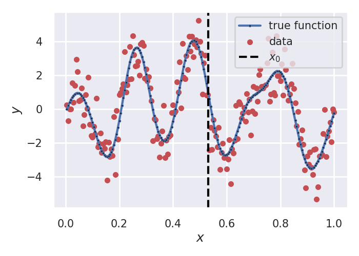

# Pointwise derivative estimation

- [Pointwise derivative estimation](#pointwise-derivative-estimation)
  - [Getting started](#getting-started)
  - [Overview](#overview)
  - [Results](#results)
  

## Getting started

```bash
conda create --name local_smooth  python==3.9
```

if poetry is not installed:

```bash
curl -sSL https://install.python-poetry.org | python3 -
```

```bash
conda activate local_smooth
```

```bash
chmod +x run.sh
```

```bash
python local_smooth/main.py --config configs/loc_lin_gauss_ker.yml
```

## Overview

$Y_i = f(X_i) + \varepsilon_i, ~\varepsilon_i \sim \mathcal{N}(0, \sigma^2)$


Unbiased risk estimate is computed as:

$\hat{\mathcal{R}}(\hat{f}) = \|\mathcal{K}_{h} \mathbf{Y} - \mathbf{Y}\|^2 + 2\sigma^2\text{tr}(\mathcal{K}_h)$

True risk is computed as:

$\mathcal{R}(\hat{f}) = \mathbb{E}((f^*)'(x_0) - \hat{f}'(x_0))^2 = ((f^*)'(x_0) - \mathcal{S}_1^{\top}\mathbf{f})^2 + \sigma^2 \|\mathcal{S}_1\|^2$,

where $\mathcal{S} = \{\Psi(x_0)W(x_0)\Psi(x_0)^{\top}\}^{-1}\Psi(x_0)W(x_0)$


## Results

* Generated data:



* Risk (Locally linear estimate, Gaussian kernel):


